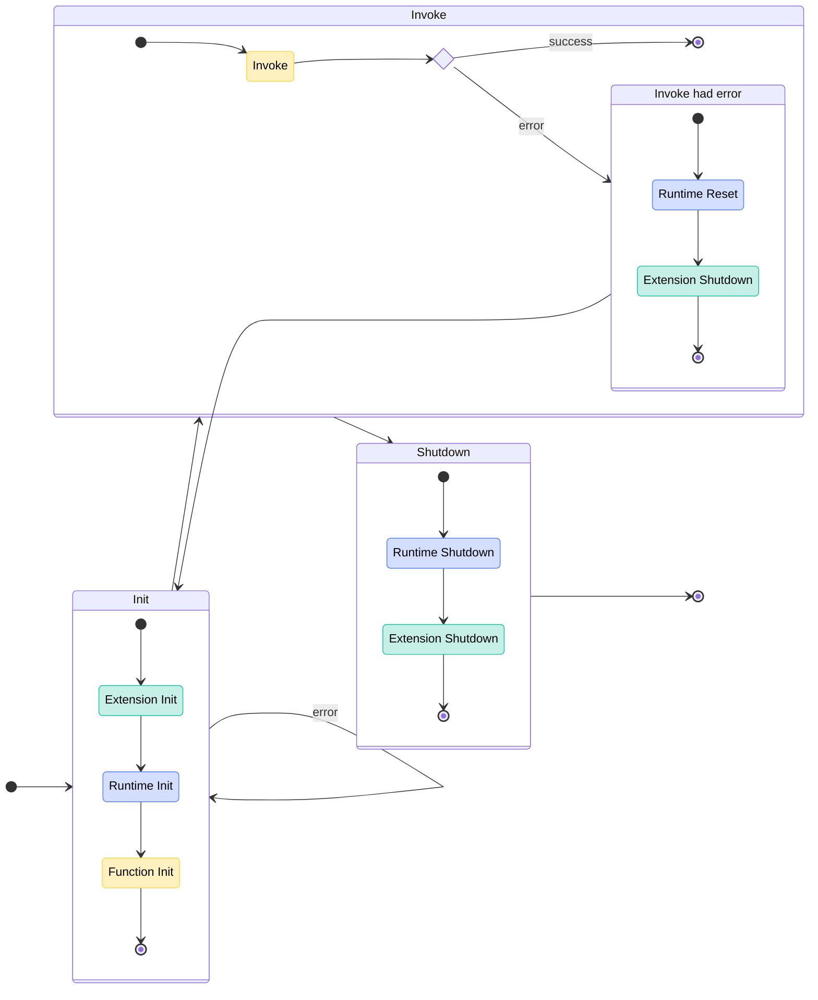
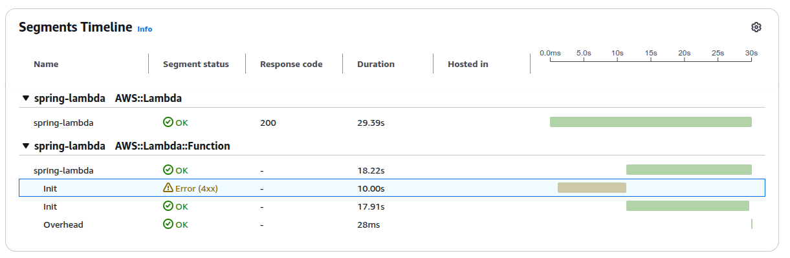
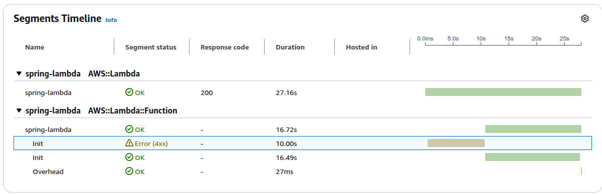
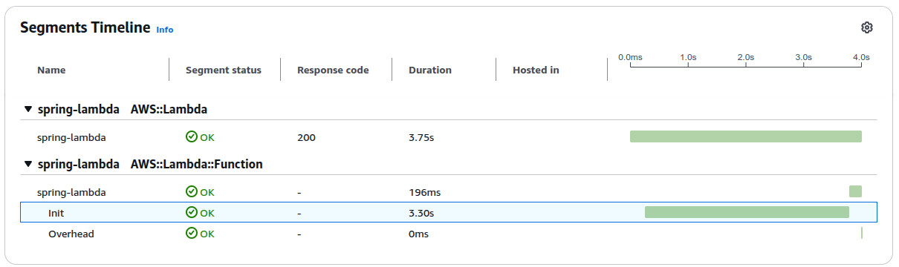

# AWS Lambda

## [What is AWS Lambda](https://docs.aws.amazon.com/lambda/latest/dg/gettingstarted-concepts.html)

- serverless function (FaaS - Function-as-a-Service)
- event driven - message appears in SQS, HTTP request incoming, etc.
- types of lambdas
    - runtime ([Firecracker microVM](https://github.com/firecracker-microvm/firecracker), [more about it](https://www.talhoffman.com/2021/07/18/firecracker-internals/))
        - managed runtime
            - Java
            - Node.js
            - TypeScript
            - Python
            - Ruby
            - Go
            - C#
            - PowerShell
        - OS-only
            - Go
            - Rust
            - any other non-official language, e.g. [bash](https://docs.aws.amazon.com/lambda/latest/dg/runtimes-walkthrough.html)
    - [Docker image](https://docs.aws.amazon.com/lambda/latest/dg/images-create.html)

## Why?

- [AWS scales Lambdas automatically](https://docs.aws.amazon.com/lambda/latest/dg/lambda-concurrency.html)
    - [by default 1000 concurrent executions across all functions in an AWS Region](https://docs.aws.amazon.com/lambda/latest/dg/lambda-concurrency.html#:~:text=By%20default,throttling.)
- pay for the compute time
    - infrequent invokes
- no need to manage servers
- glue between different AWS services
- small tools, e.g., lambda reacting to Cloudwatch alarms
- [Lambda@Edge](https://docs.aws.amazon.com/AmazonCloudFront/latest/DeveloperGuide/edge-functions-choosing.html) - customize content CloudFront delivers (only us-east-1, only Node.js or Python, no layers, no VPC)
    - reduces latency since code is executed in a location to closer user
    - more heavyweight requirements than CloudFront Functions

## [AWS Lambda Layer](https://docs.aws.amazon.com/lambda/latest/dg/chapter-layers.html)

- multiple layers can be attached
- for JVM, additional files on a classpath

## [AWS Lambda Extension](https://docs.aws.amazon.com/lambda/latest/dg/lambda-extensions.html)

- internal - runs in a runtime process. In JVM Lambdas can be modified with `JAVA_TOOL_OPTIONS`
- [external](https://docs.aws.amazon.com/lambda/latest/dg/extensions-api-partners.html) - attached as layer. Runs as a separate process
    - AWS managed
    - partners
    - [custom](https://docs.aws.amazon.com/lambda/latest/dg/runtimes-extensions-api.html)
- share resources with your Lambda code
- you still pay for the time extension executes its code

## [X-Ray](https://docs.aws.amazon.com/lambda/latest/dg/services-xray.html) - how does execution environment look in tracing

- **Init** - during this phase, Lambda initializes extensions, initializes the runtime, and runs the function's initialization code
- **Customer Subsegments** - the lambda handler code
- **Response Duration** - the time taken to transfer the response to the customer
- **Overhead** - the amount of additional time the runtime and extensions needed to finish

```mermaid
gantt
    title AWS Lambda
    dateFormat s
    axisFormat %
    section Initialization
        Init: active, init, 0, 5
    section Execution
        AWS Lambda Function: active, lambda, 5, 25
        Customer Subsegments: customer, 5, 20
        Subsegment 1: sub1, 5, 15
        Subsegment 2: sub2, 10, 15
        Subsegment 3: sub3, 15, 20
        Response Duration: res, 20, 25
    section Overhead
        Overhead: active, overhead, 25, 37
        Runtime Overhead: runtime, 25, 31
        Extensions Overhead: extensions, 31, 37
```



## [Execution environment](https://docs.aws.amazon.com/lambda/latest/dg/lambda-runtime-environment.html#runtimes-lifecycle-invoke)



- [shutdown has 2 second limit. After that everything is killed](https://docs.aws.amazon.com/lambda/latest/dg/lambda-runtime-environment.html#:~:text=Duration:%20The%20entire,SIGKILL)
- Init phase is limited to 10 seconds. [If all three tasks do not complete within 10 seconds, Lambda retries the Init phase at the time of the first function invocation with the configured function timeout](https://docs.aws.amazon.com/lambda/latest/dg/lambda-runtime-environment.html#:~:text=If%20all%20three%20tasks%20do%20not%20complete%20within%2010%20seconds,%20Lambda%20retries%20the%20Init%20phase%20at%20the%20time%20of%20the%20first%20function%20invocation%20with%20the%20configured%20function%20timeout.)
- [when invoking indirectly, the lambda will retry its execution](https://docs.aws.amazon.com/lambda/latest/dg/invocation-retries.html). The retry behavior is dependent on the service that invokes the lambda and our configuration for this connection
- Shutdown phase does not happen immediately after invoke - [AWS will keep inactive lambda for some time](https://www.pluralsight.com/resources/blog/cloud/how-long-does-aws-lambda-keep-your-idle-functions-around-before-a-cold-start), but it's not a guarantee

## Optimizing cold starts

[Cold starts benchmark](https://maxday.github.io/lambda-perf/)

### Optimizing cold starts - [SnapStart](https://docs.aws.amazon.com/lambda/latest/dg/snapstart.html)

- [CRaC](https://openjdk.org/projects/crac/) JVM mechanism
- [the 10-second timeout doesn't apply to functions that are using provisioned concurrency or SnapStart. For Provisioned Concurrency (PC) and SnapStart functions, your initialization code can run for up to 15 minutes. The time limit is 130 seconds or the configured function timeout (maximum 900 seconds), whichever is higher](https://docs.aws.amazon.com/lambda/latest/dg/lambda-runtime-environment.html#:~:text=The%2010-second%20timeout,higher.)
- [with SnapStart, Lambda initializes your function when you publish a function version. Lambda takes a Firecracker microVM snapshot of the memory and disk state of the initialized execution environment, encrypts the snapshot, and intelligently caches it to optimize retrieval latency](https://docs.aws.amazon.com/lambda/latest/dg/snapstart.html#:~:text=With%20SnapStart,latency.)
    - [snap start costs](https://docs.aws.amazon.com/lambda/latest/dg/snapstart.html#snapstart-pricing)
        - [for SnapStart Init phase costs](https://docs.aws.amazon.com/lambda/latest/dg/snapstart.html#:~:text=For%20SnapStart%20functions,a%20runtime%20hook)
    - [not available in every region](https://docs.aws.amazon.com/lambda/latest/dg/snapstart.html#snapstart-supported-regions)
    - [compatibility](https://docs.aws.amazon.com/lambda/latest/dg/snapstart.html#snapstart-compatibility)
        - [network](https://docs.aws.amazon.com/lambda/latest/dg/snapstart-best-practices.html#snapstart-networking)
        - [uniqueness](https://docs.aws.amazon.com/lambda/latest/dg/snapstart-uniqueness.html)
        - temporary data

### Optimizing cold starts - [Provisioned Concurrency (PC)](https://docs.aws.amazon.com/lambda/latest/dg/provisioned-concurrency.html)

- pre-initialized execution environments allocated to your function
- these execution environments are ready to respond immediately to incoming function requests
- additional cost since AWS must keep Lambda instances active

## JVM Lambdas (managed Java runtime AWS Lambda)

- some options, but not all
    - simple - AWS SDK
    - Spring Cloud Function -> [AWS Lambda adapter](https://docs.spring.io/spring-cloud-function/reference/adapters/aws-intro.html)
    - [AWS SAM](https://docs.aws.amazon.com/serverless-application-model/latest/developerguide/what-is-sam.html)
- [`JAVA_TOOL_OPTIONS` can be used to modify runtime behavior](https://docs.aws.amazon.com/lambda/latest/dg/java-customization.html)
- [runtime envs](https://docs.aws.amazon.com/lambda/latest/dg/configuration-envvars.html#configuration-envvars-runtime)
- structuring with Gradle
    - [Java Library Plugin](https://docs.gradle.org/current/userguide/java_library_plugin.html)
    - [configurations graph](https://docs.gradle.org/current/userguide/java_library_plugin.html#sec:java_library_configurations_graph)
    - [test fixtures](https://docs.gradle.org/current/userguide/java_testing.html#sec:java_test_fixtures)

## JVM Lambdas Best Practices

- keep classpath minimal
- minimalize runtime code
    - try to use compile time libraries like [dagger](https://github.com/google/dagger) for dependency injection or [Powertools for AWS Lambda](https://docs.powertools.aws.dev/lambda/java/)
    - compiler plugins like [manifold](https://github.com/manifold-systems/manifold) for Java or [kotlinx.serialization](https://github.com/Kotlin/kotlinx.serialization) for Kotlin
- libraries generating source that helps avoid reflection
- move dependencies to Lambda Layer
- [How do I make my Lambda function idempotent?](https://repost.aws/knowledge-center/lambda-function-idempotent)
- Observability
    - X-Ray
    - CloudWatch

## Gotchas

- depends on a service triggering Lambda
    - Lambda result is not always visible
    - returning a failure
- need more CPU? You also have to take memory - no different pricing options for memory and CPU
- AWS dependent features might cause slow development feedback loop
- all layers and lambda code have a limit of 250 MB when unzipped. This doesn't apply to Docker images (Docker up to 10 GB)
    - it should not be a real problem if sticking to best practices, although you might be a problem if developing a single artifact containing many functions which are chosen e.g. through properties, like it's possible in case of Spring Cloud Function
- automatic scaling can overload other infrastructure components, e.g., database
    - solution can be a Database Proxy in case of RDS
- I need a result from another lambda. Better change design to use:
    - AWS Step Functions
    - `InvocationType = Event` (async invoke)

## More advanced gotachs

- how to ensure code changes safety? How to allow rollback to a previous version? Canary deployments?
    - use Lambda aliases
- non deterministic zips
    - most likely build tool won't care and setup could be complicated
    - needs some automation to publish artifacts somewhere and semi-/isolated environments for developers if we don't want to have zips changed every time
- [By default, Lambda functions run in a Lambda-managed VPC that has internet access](https://docs.aws.amazon.com/lambda/latest/dg/configuration-vpc-internet.html). This is [an Amazon-controlled VPC over which you have no control or visibility](https://stackoverflow.com/a/48028819/5578442)
- how many developers are comfortable developing a whole system using this architecture? - a lot of loosely coupled, tiny components

## [OTEL](https://aws-otel.github.io/docs/getting-started/lambda)

- very slow
- lambda needs to initialize twice, because of 10 sec limit of first `Init`
    - without `OTEL_JAVA_AGENT_FAST_STARTUP_ENABLED`

      
    
    - with `OTEL_JAVA_AGENT_FAST_STARTUP_ENABLED`

      

    - without OTEL

      

### build.gradle.kts

```kotlin
dependencyManagement {
    imports {
        // or in dependencies `implementation(platform("io.opentelemetry.instrumentation:opentelemetry-instrumentation-bom:2.9.0"))` if not using plugin `io.spring.dependency-management`
        mavenBom("io.opentelemetry.instrumentation:opentelemetry-instrumentation-bom:2.9.0") // needs to be compatible with layer
    }
}

// ...

dependencies {
    // ...
    implementation("io.opentelemetry.instrumentation:opentelemetry-spring-boot-starter")
    implementation("io.opentelemetry.contrib:opentelemetry-aws-xray-propagator:1.43.0-alpha")
}
```

### TF config

```hcl
data "aws_region" "current" {}

locals {
  arch = "amd64"
}

resource "aws_lambda_function" "this" {
  # ...
  
  layers = [
    "arn:aws:lambda:${data.aws_region.current.name}:901920570463:layer:aws-otel-java-agent-${local.arch}-ver-1-32-0:4", # needs to be compatible with `opentelemetry-instrumentation-bom`
    # ...
  ]

  tracing_config {
    mode = "Active"
  }

  environment {
    variables = {
      AWS_LAMBDA_EXEC_WRAPPER              = "/opt/otel-handler",
      OTEL_PROPAGATORS                     = "xray",
      OTEL_JAVAAGENT_LOGGING               = "application", # use application's SLF4J
      OTEL_JAVA_AGENT_FAST_STARTUP_ENABLED = true,
    }
  }
}

```

## Additional links

- [How to test serverless functions and applications](https://docs.aws.amazon.com/lambda/latest/dg/testing-guide.html)
> If you do not create cloud-based tests, you could encounter issues due to differences between your local environment and the deployed environment. Your continuous integration process should run tests against a suite of resources provisioned in the cloud before promoting your code to the next deployment environment, such as QA, Staging, or Production.

- [AWS docker images](https://docs.aws.amazon.com/lambda/latest/dg/images-create.html) - with or without [RIE](https://github.com/aws/aws-lambda-runtime-interface-emulator/)

## Kotlin Native

- OS-only runtime has missing `libcrypt.so.1`
- [some guy runtime](https://github.com/trueangle/kotlin-native-aws-lambda-runtime) but it's still missing `libcrypt.so.1`
- [Kotlin Native AWS SDK](https://github.com/awslabs/aws-sdk-kotlin/issues/229) is in progress and [actively developed](https://github.com/awslabs/aws-sdk-kotlin/issues/1511#issuecomment-2614002101). [Smithy already has support for KMP](https://github.com/smithy-lang/smithy-kotlin/issues/437)
